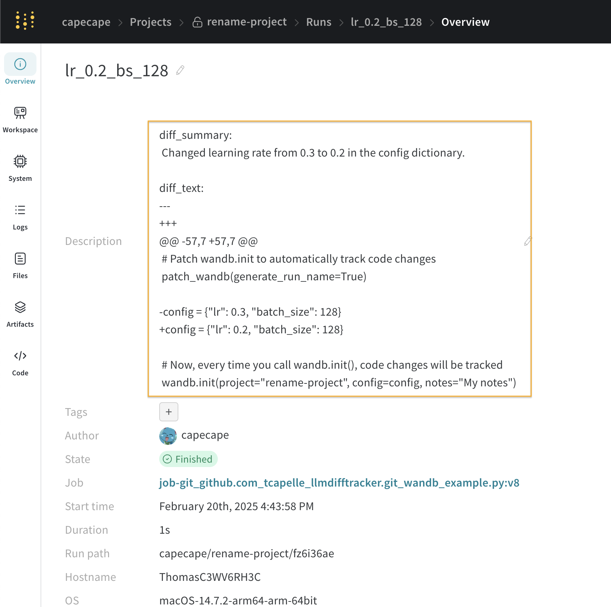

# llmdifftracker

Lightweight package that tracks and summarizes code changes using LLMs (Large Language Models). This tool helps you maintain better documentation of your code changes during development by automatically generating summaries of code modifications. It can be used standalone or integrated with Weights & Biases for experiment tracking.

## Installation

### Basic Installation
```bash
pip install git+https://github.com/fal-ai-community/llmdifftracker.git
```

### Installation with Weights & Biases Support
```bash
pip install "git+https://github.com/fal-ai-community/llmdifftracker.git#egg=llmdifftracker[wandb]"
```

## Usage

### Basic Usage with fal-api (Default)

```python
from llmdifftracker import LLMDiffTracker
import os

# Set your fal API key
os.environ["FAL_KEY"] = "your-fal-api-key"

# Initialize the tracker
tracker = LLMDiffTracker(
    api_key=os.getenv("FAL_KEY"),
    cache_dir="./code_dump_cache",  # Where to store code snapshots
    file_pattern="*.py",  # Which files to track
    system_prompt="Summarize code changes"  # Custom prompt for LLM
)

# Track changes
result = tracker.track_changes()
if result:
    diff_text, summary = result
    print("Code changes detected!")
    print("Summary:", summary)
    print("Diff:", diff_text)
```

### Using OpenAI Instead

```python
from llmdifftracker import LLMDiffTracker
import os

# Set your OpenAI API key
os.environ["OPENAI_API_KEY"] = "your-openai-api-key"

# Initialize the tracker with OpenAI
tracker = LLMDiffTracker(
    api_key=os.getenv("OPENAI_API_KEY"),
    use_fal=False,  # Specify to use OpenAI instead of fal-api
    cache_dir="./code_dump_cache",
    file_pattern="*.py",
    system_prompt="Summarize code changes"
)
```

### Integration with Weights & Biases

```python
import wandb
from llmdifftracker import patch_wandb
import os

# Set your API key (FAL_KEY takes precedence over OPENAI_API_KEY)
os.environ["FAL_KEY"] = "your-fal-api-key"
# or
os.environ["OPENAI_API_KEY"] = "your-openai-api-key"

# Patch wandb.init to automatically track code changes
# generate_run_name=True will generate a run name based on the code changes
patch_wandb(generate_run_name=True)

# Now, every time you call wandb.init(), code changes will be tracked
wandb.init(project="your-project-name")
```

### Example

The diff will be available in the overview page of the run.

 

We also log the diff to a `wandb.Table`, which you can see in the workspace page.

## Why not use Git diffs?

That is a good question. I would agree that it is more accurate. However, researchers often don't commit their code before running experiments. The reason for this is interesting: ML research is somewhat intrinsically "heisenbugged", meaning having runnable code does not mean it's better than the previous version, and in many cases it doesn't even mean it's working. This is different from software engineering, where you typically have specifications and less room for tiny, frequent, a priori unknowable bug-inducing changes.

Therefore, we default to using code diffs instead.


## Requirements

- Python 3.6+
- fal-api key (recommended) or OpenAI API key
- `fal-client` package (installed automatically)
- (Optional) Weights & Biases account

## License

MIT License

## Author

Simo Ryu (cloneofsimo)

## Contributing

Contributions are welcome! Please feel free to submit a Pull Request. 